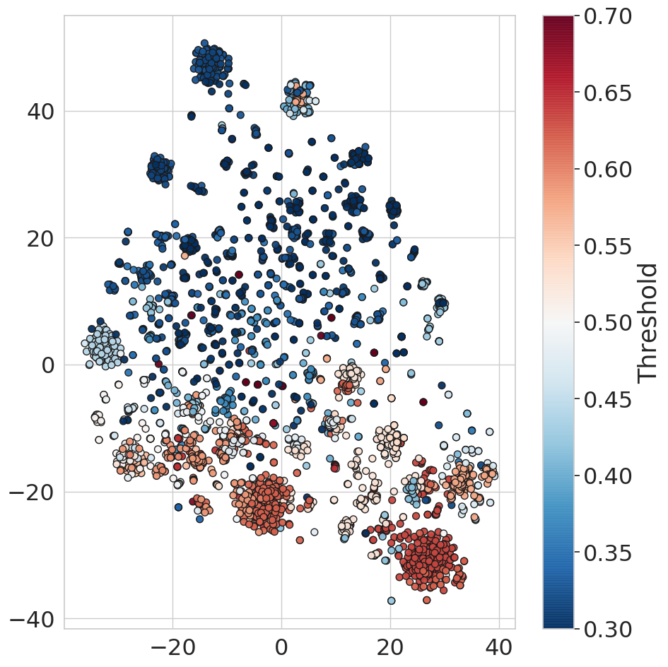
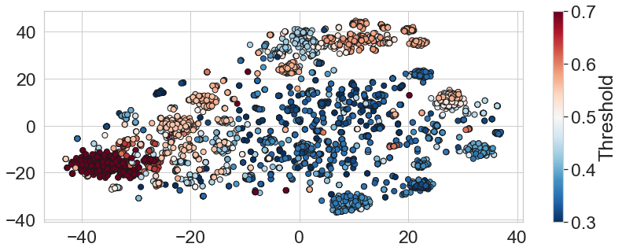
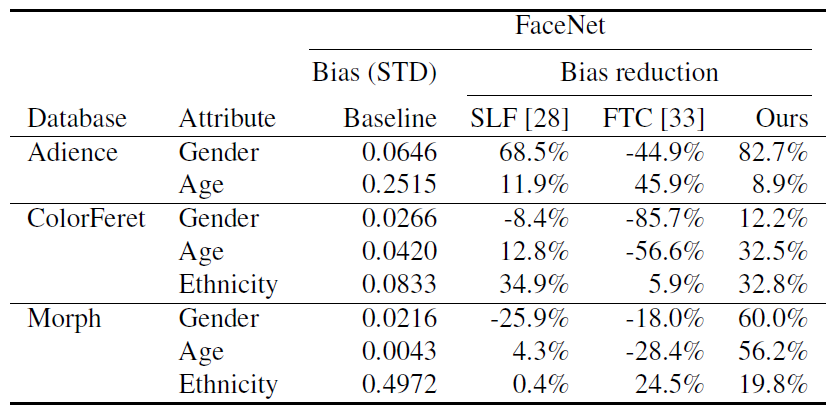
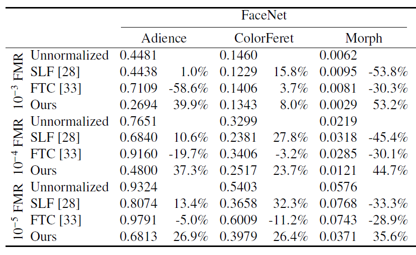

## Post-Comparison Mitigation of Demographic Bias in Face Recognition Using Fair Score Normalization



Pattern Recognition Letters 2020

* [Research Paper (arXiv)](https://arxiv.org/abs/2002.03592)
* [Research Paper (Elsevier)](https://www.sciencedirect.com/science/article/abs/pii/S0167865520304128)
* [Implementation](https://github.com/pterhoer/FairScoreNormalization/tree/main/fair_score_normalization)


## Table of Contents 

- [Abstract](#abstract)
- [The Idea Behind Fair Score Normalization](#the-idea-behind-fair-score-normalization)
- [Results](#results)
- [Installation](#installation)
- [Citing](#citing)
- [Acknowledgement](#acknowledgement)
- [License](#license)

## Abstract

Current face recognition systems achieve high progress on several benchmark tests. 
Despite this progress, recent works showed that these systems are strongly biased against demographic sub-groups.
Consequently, an easily integrable solution is needed to reduce the discriminatory effect of these biased systems. 
Previous work mainly focused on learning less biased face representations, which comes at the cost of a strongly degraded overall recognition performance. 
In this work, we propose a novel **unsupervised fair score normalization** approach that is specifically **designed to reduce the effect of bias of unkown origin** in face recognition and **subsequently lead to a significant overall performance boost**. 
Our hypothesis is **built on the notation of individual fairness** by designing a normalization approach that leads to treating ”similar” individuals ”similarly”. 
Experiments were conducted on three publicly available datasets captured under controlled and in-the-wild circumstances. 
Results demonstrate that our solution reduces demographic biases, e.g. by up to 82.7% in the case when gender is considered. 
Moreover, it mitigates the bias more consistently than existing works. 
In contrast to previous works, our fair normalization approach enhances the overall performance by up to 53.2% at false match rate 
of  and
up to 82.9% at a false match rate of . 
Additionally, it is easily integrable into existing recognition systems and not limited to face biometrics.

## The Idea Behind Fair Score Normalization

Our fair score normalization approach is based on the notation of individual fairness, resulting in a solution that treats similar individuals similarly and thus, more fairly. 
The proposed approach clusters samples in the embedding space such that similar identities are categorized without the need for pre-defined (e.g. demographic) classes. 
For each cluster, an optimal local threshold is computed.
To verifiy if two samples belong to the same identity, the two corresponding clusters are determined and the optimal local thresholds of these clusters are used to normalize the comparison score of both samples.

The following Figure shows an t-SNE visualization of the embedding space for the dataset Adience. 
The t-SNE algorithm maps the high-dimensional embedding space into a two-dimensional space such that similar samples in the high-dimension space lie closely together in two dimensions. 
Furthermore, each sample is colored based on the local thresholds computed by the proposed approach. 
Two observations can be made from this figure: 

1. It shows that there are several clusters with similar local thresholds in the embedding space.
Consequently, our proposed approach is able to identify similar identities and to treat them similarly (through similar local
thresholds). 

2. It shows that the optimal thresholds for each cluster vary significantly from 0.3 to 0.7. 
This widespread of optimal local thresholds demonstrates the need for a more individual, and thus fair, treatment.



## Results

Experiments were conducted on three publicly available datasets (Adience, ColorFeret, and Morph).
Some results of this work are shown below (based on FaceNet embeddings).
For complete results, please take a look at the paper.

First, an analysis of the bias reduction of the proposed approach (Ours) in comparison with two previous works (SLF [28] and FTC [33]) is presented. 
The bias is measured in terms of STD of the class-wise FNMRs at a FMR of . 
Unlike both related works, our proposed approach mitigates bias effectively and consistently.

  

Moreover, the improvement of the overall face recognition performance is analysed and shown in the Figure below.
The verification performance is measured in terms of FNMR at several FMRs.
Even while making the recognition process more fair, in contrast to previous work, our approach consistently improves the global recognition performance.



## Installation
We recommend Anaconda to install the required packages.
This can be done by creating an virtual environment with given environment.yml via

```shell
conda env create -f environment.yml
```
and acivating this environment:
```shell
conda activate fsn
```

or by manually installing the following python packages with given versions:

```shell
scikit-learn=0.20.3
tqdm=4.31.1
numpy=1.14.6
pandas=0.25.1
scipy=1.5.2
keras=2.2.4
tensorflow=1.14.0
matplotlib=3.2.2
seaborn=0.9.0
```
After installation you can add your own datasets by implementing the Dataset base class in _codebase.datasets.base_dataset.py_.
An example dataset is implemented in _codebase.datasets.dataset_example.py_.

[To get started please have a look at the wiki.](https://github.com/pterhoer/FairScoreNormalization/wiki)

## Citing

If you use this code, please cite the following paper.


```
@article{PRL2020Terhorst,
  author={Philipp Terh\"{o}rst and Jan Niklas Kolf and Naser Damer and Florian Kirchbuchner and Arjan Kuijper},
  title = "Post-comparison mitigation of demographic bias in face recognition using fair score normalization",
  journal = "Pattern Recognition Letters",
  volume = "140",
  pages = "332 - 338",
  year = "2020",
  issn = "0167-8655",
  doi = "https://doi.org/10.1016/j.patrec.2020.11.007",
  url = "http://www.sciencedirect.com/science/article/pii/S0167865520304128",
}
```


## Acknowledgement

This research work has been funded by the German Federal Ministery of Education and Research and the Hessen State
Ministry for Higher Education, Research and the Arts within their joint support of the National Research Center for Applied
Cybersecurity. 
Portions of the research in this paper use the FERET database of facial images collected under the FERET
program, sponsored by the Counterdrug Technology Development Program Office. 

## License 

This project is licensed under the terms of the Attribution-NonCommercial-ShareAlike 4.0 International (CC BY-NC-SA 4.0) license.
Copyright (c) 2020 Fraunhofer Institute for Computer Graphics Research IGD Darmstadt
